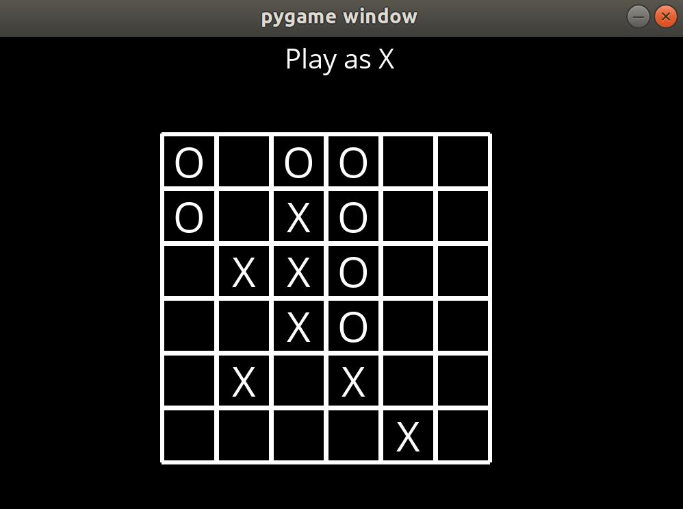
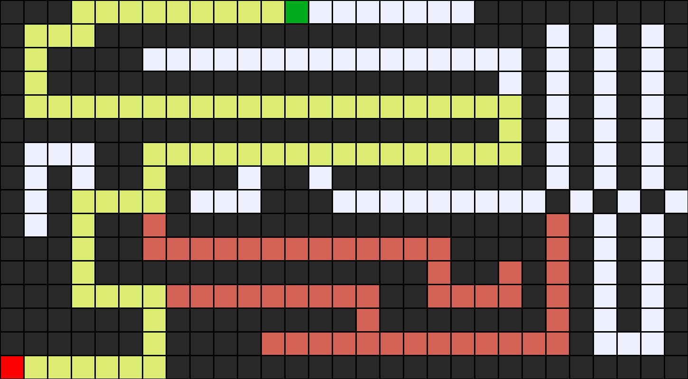

# AI projects

Several interesting games are designed using Python, Pygame and Artificial Intelligence (AI).





## Getting Started

These instructions will get you a copy of the project up and running on your local machine for development and testing purposes. See deployment for notes on how to deploy the project on a live system.

### Prerequisites

What things you need to install the software and how to install them

```
Python
Pygame
pomegranate

```

And, you need a bit of math such as the Page Rank formular


### Installing

A step by step series of examples that tell you how to get a development env running will be given in each game folder.


## Versioning

We use [SemVer](http://semver.org/) for versioning. For the versions available, see the [tags on this repository](https://github.com/philip-le/AI_projects/tags). 


## Authors

* **Hoang Phuoc Le** - *Data Scientist* - ['Github'](https://github.com/philip-le)

See also the list of [contributors](https://github.com/philip-le/AI_projects/contributors) who participated in this project.

## License

This project is licensed under the MIT License - see the [LICENSE.md](LICENSE.md) file for details

## Acknowledgments

* Hat tip to anyone whose code was used
* Inspiration from CS50AI course
* Udacity 
